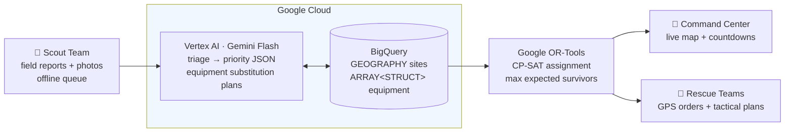

# ⛑️ Golden Hour — Earthquake USAR Decision Intelligence Platform

**Gen AI Academy APAC Hackathon** · Theme: AI for Better Living and Smarter Communities (Disaster Response & Recovery)

The first 72 hours after a major earthquake — the "golden hour" window — decide who lives. Command centers face cognitive overload: hundreds of collapsed-building reports, a dozen specialized rescue teams, and no time to compute the optimal match. **Golden Hour** turns unstructured field reports into mathematically optimized deployment orders in seconds.

Demo scenario: M7.7 Sagaing Fault earthquake, Mandalay, Myanmar (based on the March 2025 event).

## Architecture (3 layers)



| Layer | Technology | What it does |
|---|---|---|
| Data | **BigQuery** | `sites` table with native `GEOGRAPHY` points; `teams` with `ARRAY<STRUCT>` nested equipment inventories; spatial SQL (ST_DISTANCE) |
| AI | **Vertex AI — Gemini Flash** | (1) Triage: unstructured scout notes + photos → structured JSON priority score 0.0–1.0; (2) Equipment substitution: missing a 50T crane → generates lift-bag + cribbing tactical plan |
| Decision | **Google OR-Tools (CP-SAT)** | Constrained assignment: teams → sites, capability + golden-hour deadline constraints, maximizes expected survivors (survival odds halve every 24 h) |
| App | **Streamlit on Cloud Run** | Three role-based views in one deployed web app |

## Three operational views

1. **🥾 Scout Team** — fast field-report form. Network toggle simulates dead zones: reports queue locally and batch-sync when connectivity returns.
2. **🎯 Command Center** — live geospatial map (priority-colored sites, team bases), golden-hour countdown, one-click **AI Optimizer** producing deployment orders.
3. **🚒 Rescue Team** — per-team GPS orders, travel time across paved/unpaved/damaged roads, and Gemini-generated tactical rescue plans with equipment substitution.

## Quickstart (local)

```bash
pip install -r requirements.txt
python data/generate_data.py                 # synthetic Mandalay dataset (300 sites, 12 teams)
set GOOGLE_APPLICATION_CREDENTIALS=path\to\key.json   # Windows
python scripts/setup_bigquery.py             # create dataset + load BigQuery
streamlit run app.py
```

No credentials? The app auto-falls back to local CSV + heuristic triage (`FORCE_LOCAL_DATA=1`) so the demo always runs.

## Deploy to Cloud Run

```bash
gcloud run deploy golden-hour --source . --region us-central1 \
  --project usar-decision-intel --allow-unauthenticated \
  --memory 1Gi --set-env-vars GCP_PROJECT=usar-decision-intel
```

Cloud Run's default service account provides BigQuery + Vertex AI auth automatically (grant it `BigQuery Data Editor`, `BigQuery Job User`, `Vertex AI User`).

## Responsible AI

Priority scores include Gemini's reasoning for every triage (explainability); heuristic fallbacks keep the system operational when AI is unreachable; human commanders always confirm deployments — AI recommends, people decide.

## Scaling path

Prototype → production: streaming ingestion via Pub/Sub, real OSM road network routing, multi-site team itineraries (VRP), Looker dashboards for regional authorities, offline-first mobile PWA for scouts.
